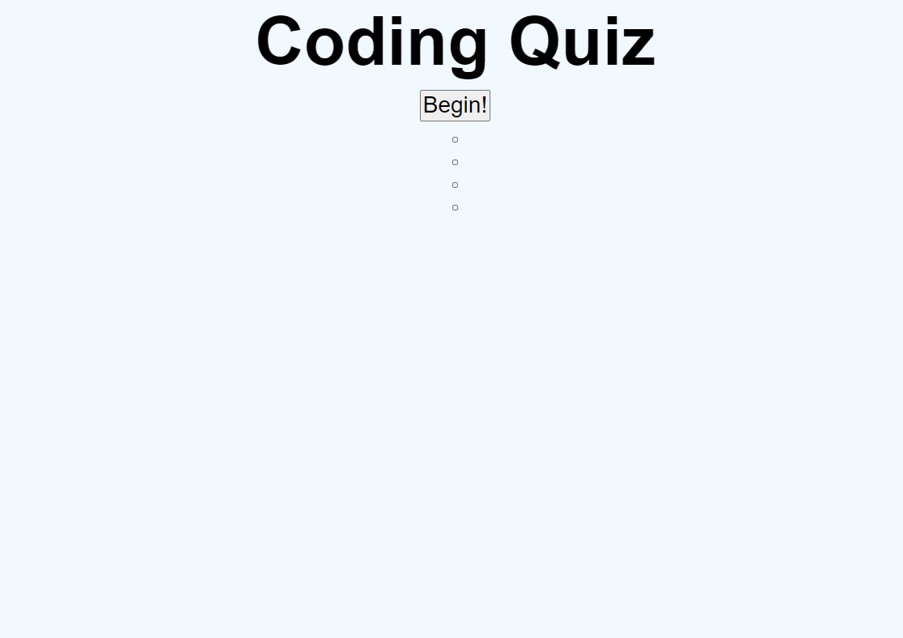
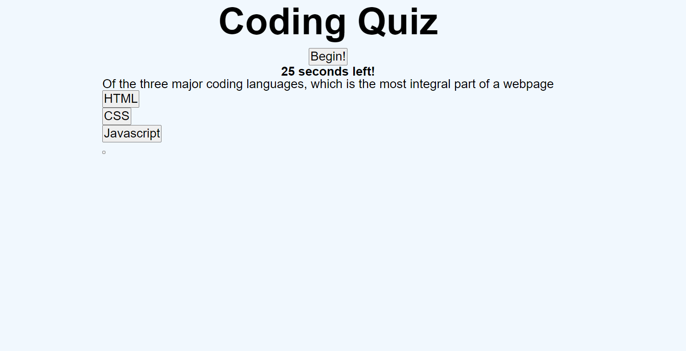
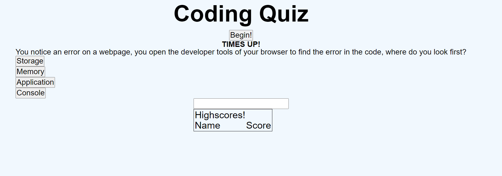
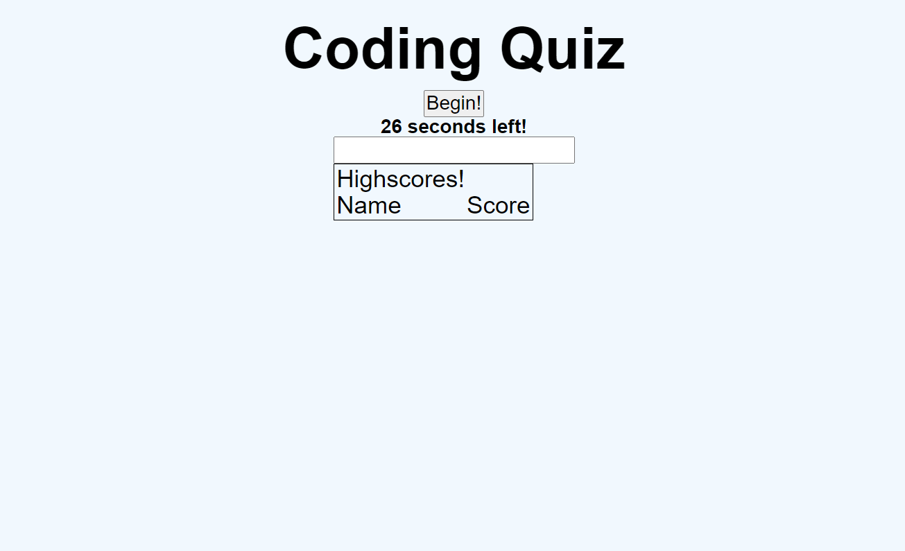

# coding-quiz-mc

##
This is a very simple Coding Quiz

When you click on the "Begin" button a Question will appear followed by several multiple choices answers and a timer starting at 30 seconds that will deprecate until reaching 0.

If you make the correct choice the quiz will replace the question and potential answers.

If you make an incorrect choice that choice will change to inform you it was correct and that two additional seconds have been removed from the timer.

If you run out of time the timer will change to display a "TIMES UP!" message. Then the scoreboard listing names and scores of those who have taken the quiz before. Additionally you are able to enter your name which will be 0.

In a Win state the timer will freeze and again the scoreboard will appear along with the ability to enter you name with the score alongside it equal to your total time remaining after complettion.